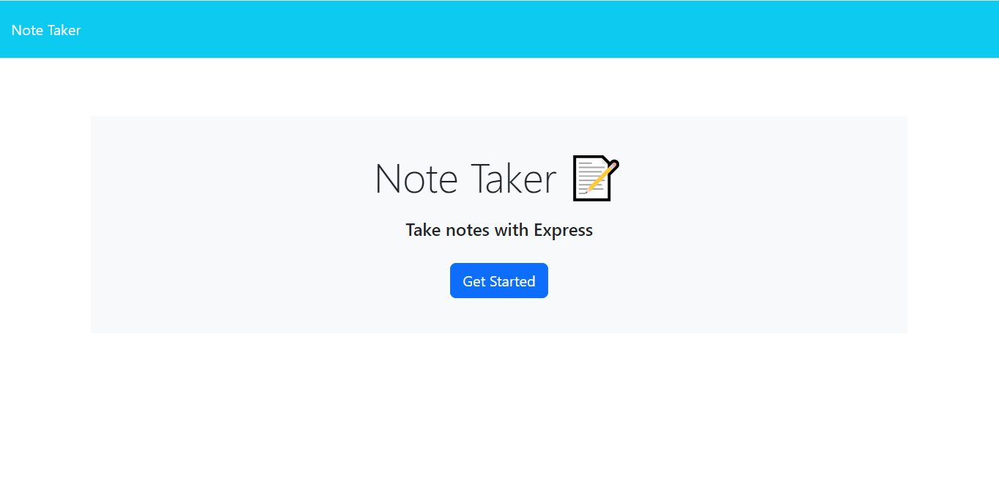
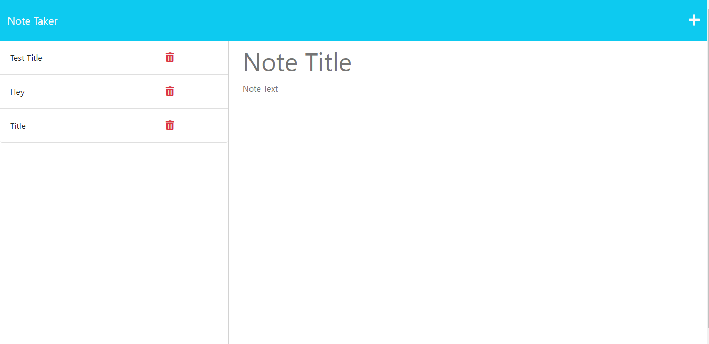

# Note taker

## Description

Note Taker is used to write and save notes. This is a user-friendly web application and also saves time. Within few minutes user can save the important notes.

## Technologies Used

- Javascrispt
- Node.js
- npm
- Express.js

## Installation

What are the steps required to install your project? 
Provide a step-by-step description of how to get the development environment running.
Installed npm using npm install in the terminal to get the package-lock.json file installed and node_modules folder.
Required an external library called express.

## Usage

Screenshot of a README.md file

   
   

## Links

-URL link for the deployed Github application: https://rudrijoshi.github.io/Note_taker/

-URL link for the Github repository: https://github.com/rudrijoshi/Note_taker/

-URL link for the Heroku deployment: https://enigmatic-beyond-89341.herokuapp.com/

